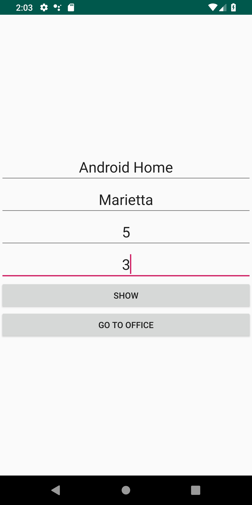
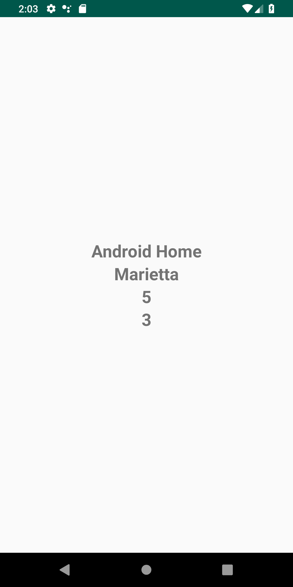
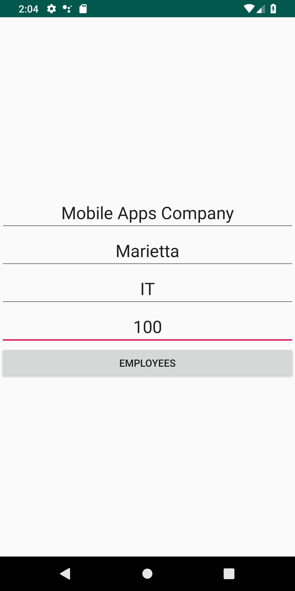
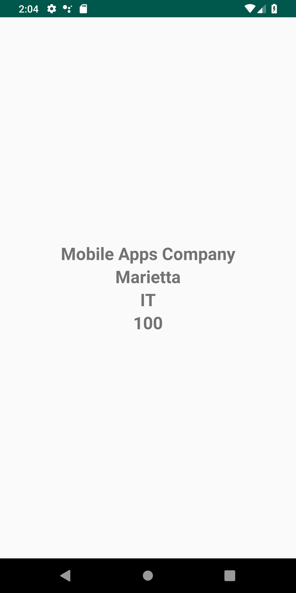

# Week4Daily2HomeAssignment
Create 2 different Object (Home and Office) with 4 different fields. Create 4 different views(Remember what is a view in MVP), one for displaying and one for data entry, for each Object. Create a user interface for all the above that allows for some sort of navigation.

Giving Home Object Data.

Showing Home Object Data.

Giving Office Object Data.

Showing Office Object Data.

